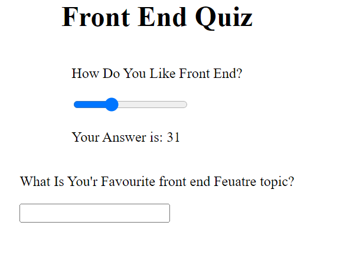
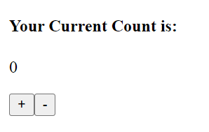
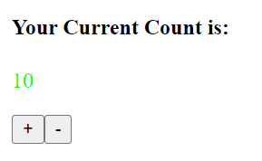
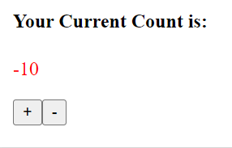
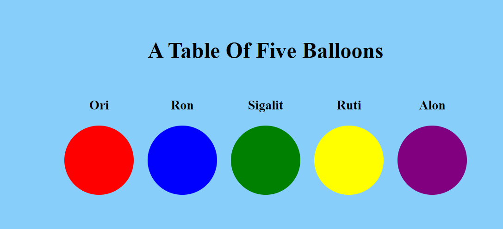

# Working-with-react-Commpents
# Counter App

This is a simple counter app that allows you to increment or decrement a value between -10 and 10.

## Functionality

The app has the following features:

- Two buttons that allow you to increment or decrement the counter.
- A label that displays the current value of the counter.
- The label color changes based on the value of the counter:
  - Red if the counter is negative.
  - Green if the counter is positive.
  - Black if the counter is 0.

## Components

The app is built using the following components:

- Quiz: The main container component for the app.
- QuizTitle: The title component for the app.
- Q1: The component for the first question.
- Q1Title: The title component for the first question.
- Q1Input: The input component for the first question.
- Q2: The component for the second question.
- Q2Title: The title component for the second question.
- Q2Input: The input component for the second question.

## Screenshots

### Q1 and Q2 Components

### Counter App

### A Tale of Five Balloons Interface

